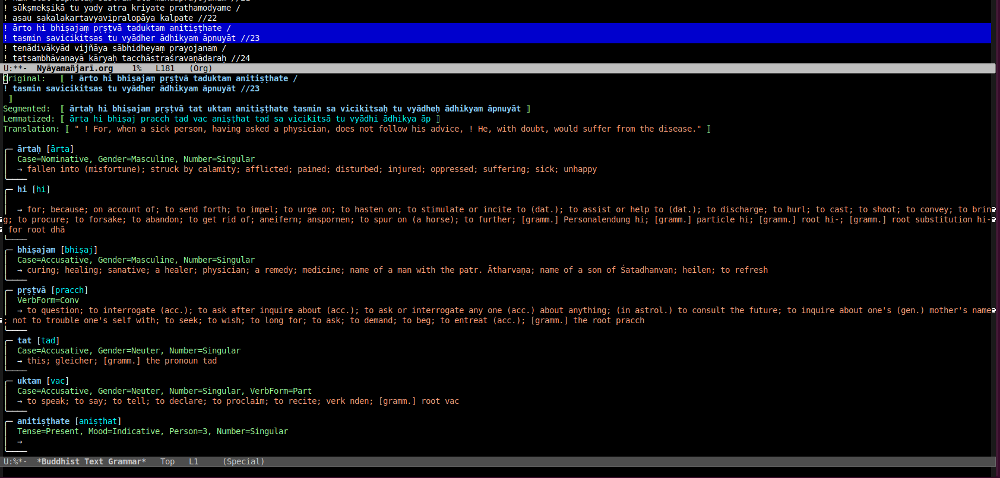

# dharmamitra-emacs

An Emacs package for translating and analyzing Sanskrit, Pāli, Tibetan, and Chinese texts using the [Dharmamitra.org](https://dharmamitra.org) API.



## Features

- Grammar analysis for Sanskrit
- English translations for Sanskrit, Chinese, Tibetan, Pali 
- Segmentation and lemmatization
- Detailed grammatical analysis with meanings

## Installation

1. Download `dharmamitra.el` to your local system
2. Add the following to your `.emacs` or `init.el`:

```elisp
;; Add the directory containing dharmamitra-text-grammar.el to load-path
(add-to-list 'load-path "/path/to/directory/containing/dharmamitra")
(require 'dharmamitra)
```

## Configuration

### Translation Settings

By default, translations are included in the analysis output. To disable translations, add this to your `.emacs`:

```elisp
(setq dharmamitra-text-include-translation nil)
```

To re-enable translations:

```elisp
(setq dharmamitra-text-include-translation t)
```

### Key Bindings

In order to enable the key binding, add this to your `.emacs`:

```elisp
;; Bind to a different key globally
(global-set-key (kbd "C-c g") #'dharmamitra-text-analyze-grammar)

;; Or bind for specific modes
(add-hook 'sanskrit-mode-hook
          (lambda ()
            (local-set-key (kbd "C-c g") #'dharmamitra-text-analyze-grammar)))
```

## Usage

1. Select the text you want to analyze
2. Press `C-c g` (or your custom keybinding)
3. The analysis will appear in a separate buffer showing:
   - Original text
   - Segmented form
   - Lemmatized form
   - Translation (if enabled)
   - Detailed grammatical analysis

The analysis buffer will be named `*Dharmamitra Text Grammar*`.

## Requirements

- Emacs 26.1 or later
- curl (for API requests)
- Internet connection to access dharmamitra.org

## Note

This package requires access to the Dharmamitra.org API. Make sure you have a working internet connection when using it.

## Citation
The preprint to this system is available on [arxiv](https://arxiv.org/abs/2409.13920). 
There is also a github repository with the actual models and description on their use [here](https://github.com/sebastian-nehrdich/byt5-sanskrit-analyzers/).  
If you like our work and use it in your research, feel free to cite the paper:
```
@inproceedings{
nehrdichetal2024,
title={One Model is All You Need: ByT5-Sanskrit, a Unified Model for Sanskrit {NLP} Tasks},
author={Nehrdich, Sebastian and Hellwig, Oliver and Keutzer, Kurt},
booktitle={Findings of the 2024 Conference on Empirical Methods in Natural Language Processing},
year={2024},
}
