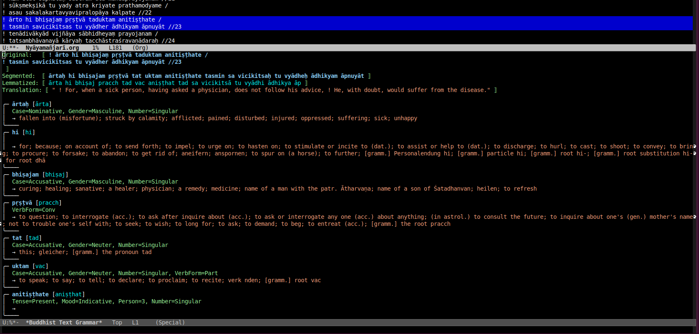

# dharmamitra-emacs

An Emacs package for translating and analyzing Sanskrit, Pāli, Tibetan, and Chinese texts using the public [Dharmamitra.org](https://dharmamitra.org) API. No API key is needed.



## Features

- Grammar analysis for Sanskrit: segmentation, lemmatization and morphosyntactic tags
- Dictionary glosses per word (DCS, Monier-Williams, Apte, Böhtlingk-Roth, Edgerton, MITRA Lexicon), expandable in place, with links to the scanned pages
- Translations for Sanskrit, Pāli, Tibetan and Chinese into English and other languages
- Requests run asynchronously and in parallel, so Emacs stays responsive
- A dedicated analysis buffer with keys to re-run, switch languages, navigate words and copy results

## Installation

1. Download `dharmamitra.el` to your local system
2. Add the following to your `.emacs` or `init.el`:

```elisp
;; Add the directory containing dharmamitra.el to load-path
(add-to-list 'load-path "/path/to/directory/containing/dharmamitra")
(require 'dharmamitra)
(global-set-key (kbd "C-c g") #'dharmamitra-text-analyze-grammar)
(global-set-key (kbd "C-c t") #'dharmamitra-text-translate)
```

With `use-package` and `straight.el`:

```elisp
(use-package dharmamitra
  :straight (dharmamitra :type git :host github :repo "dharmamitra/dharmamitra-emacs")
  :bind (("C-c g" . dharmamitra-text-analyze-grammar)
         ("C-c t" . dharmamitra-text-translate)))
```

The package does not bind any keys by itself; the bindings above are suggestions.

## Usage

1. Select the text you want to analyze, or just put point on a line
2. Press `C-c g` (`dharmamitra-text-analyze-grammar`) for grammar and translation, or `C-c t` (`dharmamitra-text-translate`) for the translation alone
3. The `*Dharmamitra*` buffer opens and fills in as results arrive:
   - Original text
   - Segmented and lemmatized forms
   - Translation (if enabled)
   - One block per word with its tag and dictionary glosses

You can also run `M-x dharmamitra-text-analyze-string` to type text directly.

Multi-line input is analyzed line by line for grammar and translated as a whole. Grammar analysis is only available for Sanskrit (and, with limitations, Pāli); for Tibetan and Chinese only the translation is shown. `dharmamitra-text-translate` always translates, even when translations are disabled for the grammar view.

### Keys in the analysis buffer

| Key   | Action                                                        |
|-------|---------------------------------------------------------------|
| `TAB` | Expand or collapse the full dictionary entries of the word at point |
| `E`   | Expand or collapse the entries of all words                   |
| `n` / `p` | Move to the next / previous word                          |
| `RET` on a source name | Open the scanned dictionary page in your browser |
| `w`   | Copy the value at point (original, segmented, lemmatized, translation, or the word's form, lemma and tag) |
| `g`   | Run the analysis again                                        |
| `t`   | Toggle translation on or off and re-run                       |
| `l`   | Choose the target language and re-run                         |
| `s`   | Choose the source language (auto, sanskrit, pali, tibetan, chinese) and re-run |
| `q`   | Close the buffer                                              |

The mode line shows the current language pair, for example `Dharmamitra[sa→english]`.

## Configuration

All options live in the `dharmamitra` customization group (`M-x customize-group RET dharmamitra`).

### Translation

Translations are included by default. To disable them (which makes the analysis noticeably faster):

```elisp
(setq dharmamitra-text-include-translation nil)
```

Target language (default `"english"`; see `dharmamitra-text-target-languages` for known values):

```elisp
(setq dharmamitra-text-target-language "german")
```

Source language. By default Tibetan and Chinese script are detected automatically and everything else is treated as Sanskrit. Pāli and Sanskrit cannot be told apart reliably in Latin script, so set this when working with Pāli:

```elisp
(setq dharmamitra-text-source-language 'pali)
```

Style instruction passed to the translator (default `"balanced"`):

```elisp
(setq dharmamitra-text-translation-style "literal")
```

### Grammar

Tag terminology, `"western"` (default) or `"indic"`:

```elisp
(setq dharmamitra-text-grammar-type "indic")
```

Length of the collapsed glosses and of the expanded entries:

```elisp
(setq dharmamitra-text-meaning-max-length 160)
(setq dharmamitra-text-entry-max-length 4000)
```

### Display and key bindings

Where the analysis buffer is shown (a `display-buffer` action, default at the bottom):

```elisp
(setq dharmamitra-text-display-action '(display-buffer-in-side-window (side . right)))
```

Commands to bind (see Installation): `dharmamitra-text-analyze-grammar`, `dharmamitra-text-translate` and `dharmamitra-text-analyze-string`.

## API endpoints

The package talks to two public endpoints, both configurable:

- Grammar: `https://dharmamitra.org/api-tagging/tagging-parsed/` (`dharmamitra-text-tagging-url`)
- Translation: `https://dharmamitra.org/api-search/cat-translate/v1/translate` (`dharmamitra-text-translation-url`)

The translation endpoint is rate limited per IP (about 10 requests per minute). If you hit the limit the buffer shows the error message returned by the server.

## Requirements

- Emacs 26.1 or later
- curl (for API requests)
- Internet connection to access dharmamitra.org

## License

GPL-3.0-or-later. See [LICENSE](LICENSE).

## Citation
The preprint to this system is available on [arxiv](https://arxiv.org/abs/2409.13920).
There is also a github repository with the actual models and description on their use [here](https://github.com/sebastian-nehrdich/byt5-sanskrit-analyzers/).
If you like our work and use it in your research, feel free to cite the paper:
```
@inproceedings{
nehrdichetal2024,
title={One Model is All You Need: ByT5-Sanskrit, a Unified Model for Sanskrit {NLP} Tasks},
author={Nehrdich, Sebastian and Hellwig, Oliver and Keutzer, Kurt},
booktitle={Findings of the 2024 Conference on Empirical Methods in Natural Language Processing},
year={2024},
}
```
